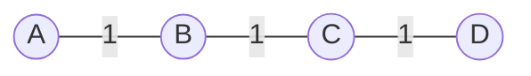
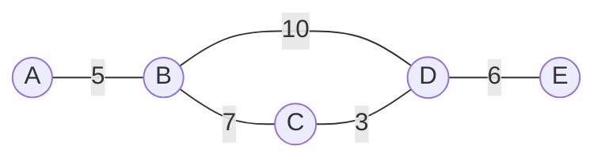
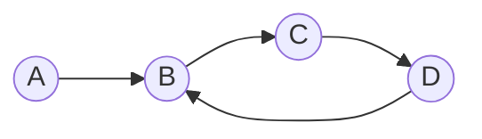
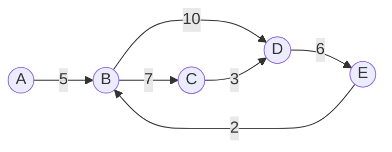

# Adjacency matrix

## Undirected

Undirected graphs are symmetric.

### Unweighted

> $$
> \def\arraystretch{1.5}
> \begin{array}{c|c:c:c:c:c:c}
>     & A & B & C & D \\ \hline
>   A & 0 & 1 & 0 & 0 \\
>   B & 1 & 0 & 1 & 0 \\
>   C & 0 & 1 & 0 & 1 \\
>   D & 0 & 0 & 1 & 0 \\
> \end{array}
> $$

### Weighted

> $$
> \def\arraystretch{1.5}
> \begin{array}{c|c:c:c:c:c:c}
>     & A & B & C & D & E \\ \hline
>   A & \infty & 5 & \infty & \infty & \infty \\
>   B & 5 & \infty & 7 & 10 & \infty \\
>   C & \infty & 7 & \infty & 3 & \infty \\
>   D & \infty & 10 & 3 & \infty & 6 \\
>   E & \infty & \infty & \infty & 6 & \infty \\
> \end{array}
> $$

## Directed

Directed graphs are not necessarily symmetric.

### Unweighted

> $$
> \def\arraystretch{1.5}
> \begin{array}{c|c:c:c:c:c:c}
>     & A & B & C & D \\ \hline
>   A & 0 & 1 & 0 & 0 \\
>   B & 0 & 0 & 1 & 0 \\
>   C & 0 & 0 & 0 & 1 \\
>   D & 0 & 1 & 0 & 0 \\
> \end{array}
> $$

### Weighted

> $$
> \def\arraystretch{1.5}
> \begin{array}{c|c:c:c:c:c:c}
>     & A & B & C & D & E \\ \hline
>   A & \infty & 5 & \infty & \infty & \infty \\
>   B & \infty & \infty & 7 & 10 & \infty \\
>   C & \infty & \infty & \infty & 3 & \infty \\
>   D & \infty & \infty & \infty & \infty & 6 \\
>   E & \infty & 2 & \infty & \infty & \infty \\
> \end{array}
> $$

