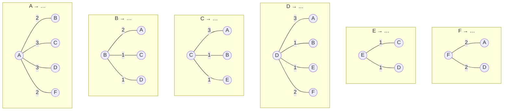
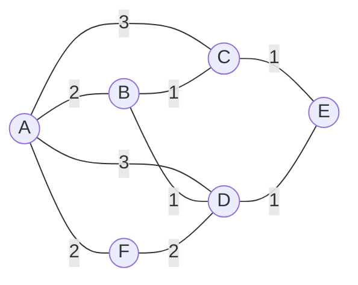
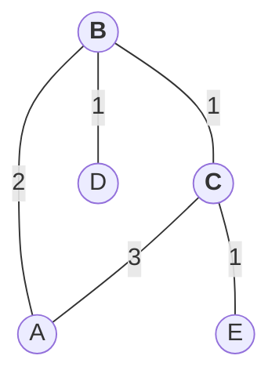
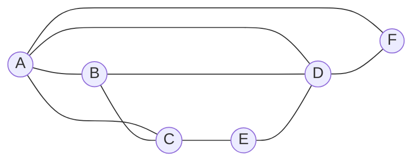
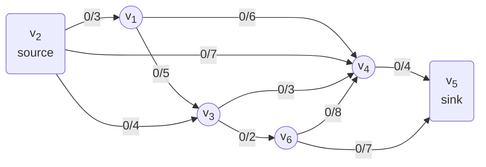

<!-- KaTeX -->
<script
  type="text/javascript"
  src="http://cdn.mathjax.org/mathjax/latest/MathJax.js?config=TeX-AMS-MML_HTMLorMML">
</script>
<script
  type="text/x-mathjax-config">
  MathJax.Hub.Config({tex2jax: {inlineMath: [['$','$'], ['\\(','\\)']]}});
</script>

# [Homework 3](https://github.com/hanggrian/IIT-CS579/raw/assets/assignments/hw3.pdf)

## Problem 1

> Given the following adjacency matrix:
>
> $$
> \begin{bmatrix}
>   0 & 2 & 3 & 3 & 0 & 2 \\\\
>   2 & 0 & 1 & 1 & 0 & 0 \\\\
>   3 & 1 & 0 & 0 & 1 & 0 \\\\
>   3 & 1 & 0 & 0 & 1 & 2 \\\\
>   0 & 0 & 1 & 1 & 0 & 0 \\\\
>   2 & 0 & 0 & 2 & 0 & 0
> \end{bmatrix}
> $$
>
> 1.  Draw and label the graph.

The matrix size is 6&times;6, so there are 6 nodes in the graph.

$$
\def\arraystretch{1.5}
\begin{array}{c|c:c:c:c:c:c}
    & A & B & C & D & E & F \\\\ \hline
  A & \infty & 2 & 3 & 3 & \infty & 2 \\\\
  B & 2 & \infty & 1 & 1 & \infty & \infty \\\\
  C & 3 & 1 & \infty & \infty & 1 & \infty \\\\
  D & 3 & 1 & \infty & \infty & 1 & 2 \\\\
  E & \infty & \infty & 1 & 1 & \infty & \infty \\\\
  F & 2 & \infty & \infty & 2 & \infty & \infty
\end{array}
$$

Then, determine the paths from a node to another and the weights of the paths.



Combining all the paths, we have the directed weighted graph.



> 2.  What is the probability of a node in this graph having degree 3?

There are 2 nodes with degree of 3, B and C.



Using the formula degree distribution probability formula.

$$
\begin{align}
  P(d) &= \frac{n_d}{n} \\\\
  P(3) &= \frac{2}{6} &= \mathbf{\frac{1}{3}}
\end{align}
$$

> 3.  What is the diameter of the graph?

First, find the shortest paths between each pair of nodes using Floyd-Warshall
algorithm.

| | &emsp;&emsp;A&emsp;&emsp; | &emsp;&emsp;B&emsp;&emsp; | &emsp;&emsp;C&emsp;&emsp; | &emsp;&emsp;D&emsp;&emsp; | &emsp;&emsp;E&emsp;&emsp; | &emsp;&emsp;F&emsp;&emsp;
| :---: | :---: | :---: | :---: | :---: | :---: | :---:
**A** | | $2$ | $3$ | $3$ | $A \xrightarrow{3} C \xrightarrow{1} E \\\\ A \xrightarrow{3} D \xrightarrow{1} E$ | $2$
**B** | $2$ | | $1$ | $1$ | $B \xrightarrow{1} C \xrightarrow{1} E \\\\ B \xrightarrow{1} D \xrightarrow{1} E$ | $B \xrightarrow{1} D \xrightarrow{2} F$
**C** | $3$ | $1$ | | $C \xrightarrow{1} B \xrightarrow{1} D \\\\ C \xrightarrow{1} E \xrightarrow{1} D$ | $1$ | $C \xrightarrow{1} B \xrightarrow{1} D \xrightarrow{2} F$
**D** | $3$ | $1$ | $"$ | | $1$ | $2$
**E** | $"$ | $"$ | $1$ | $1$ | | $E \xrightarrow{1} D \xrightarrow{2} F$
**F** | $2$ | $"$ | $"$ | $2$ | $"$

Having computed the paths, update the weights table.

$$
\def\arraystretch{1.5}
\begin{array}{c|c:c:c:c:c:c}
    & A & B & C & D & E & F \\\\ \hline
  A & \infty & 2 & 3 & 3 & 4 & 2 \\\\
  B & 2 & \infty & 1 & 1 & 2 & 3 \\\\
  C & 3 & 1 & \infty & 2 & 1 & 4 \\\\
  D & 3 & 1 & 2 & \infty & 1 & 2 \\\\
  E & 4 & 2 & 1 & 1 & \infty & 3 \\\\
  F & 2 & 3 & 4 & 2 & 3 & \infty
\end{array}
$$

The diameter of a graph is the max shortest path in the table.

$$
\begin{align}
  D(G) &= \max(v_i, v_j) \in v \cdot v^{l_{i, j}} \\\\
  &= \max(1, 2, 3, 4) &= \mathbf{4}
\end{align}
$$

> 4.  Provide a table with the betweenness centrality, closeness centrality and
      strength for each node.

Betweeness centrality measures the node's importance by counting the occurences
of shortest paths passing through the node. First, find the intermediate nodes
in the shortest paths.

Path | Shortest path | Passing through | Contribution
--- | --- | --- | ---:
A &rarr; E | A &rarr; C &rarr; E<br>A &rarr; D &rarr; E<br>A &rarr; B &rarr; C &rarr; E<br>A &rarr; B &rarr; D &rarr; E | B<br>C<br>D | 0.5<br>0.5
B &rarr; E | B &rarr; C &rarr; E<br>B &rarr; D &rarr; E | C<br>D | 0.5<br>0.5
B &rarr; F | B &rarr; D &rarr; F | D | 1
C &rarr; D | C &rarr; B &rarr; D<br>C &rarr; E &rarr; D | B<br>E | 0.5<br>0.5
C &rarr; F | C &rarr; B &rarr; D &rarr; F<br>C &rarr; E &rarr; D &rarr; F | D<br>B<br>E | 1<br>0.5<br>0.5
E &rarr; F | E &rarr; D &rarr; F | D | 1

Having found the intermediate nodes, find the paths passing through them.

Path | A | B | C | D | E | F
--- | --- | --- | --- | --- | --- | ---
A &rarr; C | - | 0.5 | - | - | - | -
A &rarr; D | - | 0.5 | - | - | - | -
A &rarr; E | - | 0.5 | 0.5 | 0.5 | - | -
B &rarr; E | - | - | 0.5 | 0.5 | - | -
B &rarr; F | - | - | - | 1 | - | -
C &rarr; D | - | 0.5 | - | - | 0.5 | -
C &rarr; F | - | 0.5 | - | 1 | 0.5 | -
E &rarr; F | - | - | - | 1 | - | -

A | B | C | D | E | F
--- | --- | --- | --- | --- | ---
| - | C &rarr; D | A &rarr; E<br>B &rarr; E | A &rarr; E<br>B &rarr; E<br>B &rarr; F<br>C &rarr; F<br>E &rarr; F | C &rarr; D | -

Then, combine the contributions of each path to get the betweenness centrality.

$$
\begin{align}
  C_b(v_i) &= \sum_{s \neq t \neq v_i} \frac{\sigma_{st}(v_i)}{\sigma_{st}} \\\\
  C_b(A) &&= \mathbf{0} \\\\
  C_b(B) &= (A \to C + A \to D + A \to E + C \to D + C \to F) \cdot 2 \\\\
  &= (0.5 + 0.5 + 0.5 + 0.5 + 0.5) \cdot 2 &= \mathbf{5} \\\\
  C_b(C) &= (A \to E + B \to E) \cdot 2 \\\\
  &= (0.5 + 0.5) \cdot 2 &= \mathbf{2} \\\\
  C_b(D) &= (A \to E + B \to E + B \to F + C \to F + E \to F) \cdot 2 \\\\
  &= (0.5 + 0.5 + 1 + 1 + 1) \cdot 2 &= \mathbf{8} \\\\
  C_b(E) &= (C \to D + C \to F) \cdot 2 \\\\
  &= (0.5 + 0.5) \cdot 2 &= \mathbf{2} \\\\
  C_b(F) &&= \mathbf{0}
\end{align}
$$

Closeness centrality is the average shortest distance from a node to all other
nodes. $L$ is the distance from $v_i$ to $v_j$.

$$
\begin{align}
  C_c(v_i) &= \frac{n - 1}{\sum_{v_j \neq v_i} L(v_i, v_j)} \\\\
  C_c(A) &= \frac{5}{L(A, B) + L(A, C) + L(A, D) + L(A, E) + L(A, F)} \\\\
  &= \frac{5}{2 + 3 + 3 + 4 + 2} &= \mathbf{\frac{5}{14}} \\\\
  C_c(B) &= \frac{5}{L(B, A) + L(B, C) + L(B, D) + L(B, E) + L(B, F)} \\\\
  &= \frac{5}{2 + 1 + 1 + 2 + 3} &= \mathbf{\frac{5}{9}} \\\\
  C_c(C) &= \frac{5}{L(C, A) + L(C, B) + L(C, D) + L(C, E) + L(C, F)} \\\\
  &= \frac{5}{3 + 1 + 2 + 1 + 4} &= \mathbf{\frac{5}{11}} \\\\
  C_c(D) &= \frac{5}{L(D, A) + L(D, B) + L(D, C) + L(D, E) + L(D, F)} \\\\
  &= \frac{5}{3 + 1 + 2 + 1 + 2} &= \mathbf{\frac{5}{9}} \\\\
  C_c(E) &= \frac{5}{L(E, A) + L(E, B) + L(E, C) + L(E, D) + L(E, F)} \\\\
  &= \frac{5}{4 + 2 + 1 + 1 + 3} &= \mathbf{\frac{5}{11}} \\\\
  C_c(F) &= \frac{5}{L(F, A) + L(F, B) + L(F, C) + L(F, D) + L(F, E)} \\\\
  &= \frac{5}{2 + 3 + 4 + 2 + 3} &= \mathbf{\frac{5}{14}}
\end{align}
$$

Strength of a node is defined as the sum of the weights of its edges.

$$
\begin{align}
  S(v) &= \sum_{j} w_{i, j} \\\\
  S(A) &= w_{A, B} + w_{A, C} + w_{A, D} + w_{A, F} \\\\
  &= 2 + 3 + 3 + 2 &= \mathbf{10} \\\\
  S(B) &= w_{B, A} + w_{B, C} + w_{B, D} \\\\
  &= 2 + 1 + 1 &= \mathbf{4} \\\\
  S(C) &= w_{C, A} + w_{C, B} + w_{C, E} \\\\
  &= 3 + 1 + 1 &= \mathbf{5} \\\\
  S(D) &= w_{D, A} + w_{D, B} + w_{D, E} + w_{D, F} \\\\
  &= 3 + 1 + 1 + 2 &= \mathbf{7} \\\\
  S(E) &= w_{E, C} + w_{E, D} \\\\
  &= 1 + 1 &= \mathbf{2} \\\\
  S(F) &= w_{F, A} + w_{F, D} \\\\
  &= 2 + 2 &= \mathbf{4}
\end{align}
$$

Combining all the results above, we have the following table.

Node | Betweenness<br>centrality | Closeness<br>centrality | Strength
--- | ---: | ---: | ---:
A | 0 | 5/14 | 10
B | 5 | 5/9 | 4
C | 2 | 5/11 | 5
D | 8 | 5/9 | 7
E | 2 | 5/11 | 2
F | 0 | 5/14 | 4

## Problem 2

> Given the following adjacency matrix:
>
> $$
> \begin{bmatrix}
>   0 & 1 & 1 & 1 & 0 & 1 \\\\
>   1 & 0 & 1 & 1 & 0 & 0 \\\\
>   1 & 1 & 0 & 0 & 1 & 0 \\\\
>   1 & 1 & 0 & 0 & 1 & 1 \\\\
>   0 & 0 & 1 & 1 & 0 & 0 \\\\
>   1 & 0 & 0 & 1 & 0 & 0
> \end{bmatrix}
> $$



> 1.  Provide the local clustering coefficient for each node.

First, identify the neighbors of each node. Then, calculate the number of
connections and check if there is an edge between them.

Node | Neighbors | Neighbor paths | Has edge
--- | --- | --- | :---:
A | B, C, D, F | B &rarr; C<br>B &rarr; D<br>B &rarr; F<br>C &rarr; D<br>C &rarr; F<br>D &rarr; F | &check;<br>&check;<br>&cross;<br>&cross;<br>&cross;<br>&check;
B | A, C, D | A &rarr; C<br>A &rarr; D<br>C &rarr; D | &check;<br>&check;<br>&cross;
C | A, B, E | A &rarr; B<br>A &rarr; E<br>B &rarr; E | &check;<br>&cross;<br>&cross;
D | A, B, E, F | A &rarr; B<br>A &rarr; E<br>A &rarr; F<br>B &rarr; E<br>B &rarr; F<br>E &rarr; F | &check;<br>&cross;<br>&check;<br>&cross;<br>&cross;<br>&cross;
E | C, D | C &rarr; D | &cross;
F | A, D | A &rarr; D | &check;

The local clustering coefficient can be calculated by dividing the number of
found edges by possible edges.

$$
\begin{align}
  C_l(v_i) &= \frac{b_i}{\binom{k}{2}} \\\\
  C_l(A) &= \frac{B \to C + B \to D + D \to F}{6} \\\\
  &= \frac{1 + 1 + 1}{6} &= \frac{1}{2} \\\\
  C_l(B) &= \frac{A \to C + A \to D}{3} \\\\
  &= \frac{1 + 1}{3} &= \frac{2}{3} \\\\
  C_l(C) &= \frac{A \to B}{3} \\\\
  &= \frac{1}{3} &= \frac{1}{3} \\\\
  C_l(D) &= \frac{A \to B + A \to F}{6} \\\\
  &= \frac{1 + 1}{6} &= \frac{1}{3} \\\\
  C_l(E) &= \frac{0}{1} &= \mathbf{0} \\\\
  C_l(F) &= \frac{A \to D}{1} \\\\
  &= \frac{1}{1} &= \mathbf{1}
\end{align}
$$

> 2.  Provide the global clustering coefficient for the graph.

The global clustering coefficient is the average of the local clustering
coefficients.

$$
\begin{align}
  C_g(\lbrace A, \ldots, F \rbrace) &= \frac{1}{n} \cdot \sum_{i=1}^{n} C_l(v_i) \\\\
  &= \frac{1}{6} \cdot
    (C_l(A) + C_l(B) + C_l(C) + C_l(D) + C_l(E) + C_l(F)) \\\\
  &= \frac{1}{6} \cdot
    \left(
      \frac{1}{2} + \frac{2}{3} + \frac{1}{3} + \frac{1}{3} + 0 + 1
    \right) \\\\
  &= \frac{1}{6} \cdot
    \left(
      \frac{3}{6} + \frac{4}{6} + \frac{2}{6} + \frac{2}{6} + 0 + 1
    \right) \\\\
  &= \frac{1}{6} \cdot \frac{17}{6} &= \mathbf{\frac{17}{36}}
\end{align}
$$

> 3.  Provide the degree sequence for each node.

Count the degree, that is, how many edges are connected to each node.

$$
\begin{matrix}
  D(A) &= 0 & + & 1 & + & 1 & + & 1 & + & 0 & + & 1 \\\\
  D(B) &= 1 & + & 0 & + & 1 & + & 1 & + & 0 & + & 0 \\\\
  D(C) &= 1 & + & 1 & + & 0 & + & 0 & + & 1 & + & 0 \\\\
  D(D) &= 1 & + & 1 & + & 0 & + & 0 & + & 1 & + & 1 \\\\
  D(E) &= 0 & + & 0 & + & 1 & + & 1 & + & 0 & + & 0 \\\\
  D(F) &= 1 & + & 0 & + & 0 & + & 1 & + & 0 & + & 0
\end{matrix} =
\begin{Bmatrix}
  \mathbf{4} \\\\
  \mathbf{3} \\\\
  \mathbf{3} \\\\
  \mathbf{4} \\\\
  \mathbf{2} \\\\
  \mathbf{2}
\end{Bmatrix}
$$

The degree sequence, in descending order, is $\lbrace 4, 4, 3, 3, 2, 2 \rbrace$.

## Problem 3

> Given the following graph:
>
> ```mermaid
> graph LR
>   A((A))
>   B((B))
>   C((C))
>   D((D))
>   E((E))
>   F((F))
>   G((G))
>
>   A <--> B
>   A <--> D
>
>   B --> D
>   B --> E
>
>   C --> B
>   C --> D
>
>   E --> C
>   E --> G
>
>   F --> E
>   F --> D
>   F <--> G
> ```
>
> Using the simple PageRank algorithm from class, iterate until you have a
  stable rank. For each iteration, show the PageRank values and rank for each
  node.

Determine the incoming and outgoing edges for each node. The number of degrees
corresponds to the how many PageRank values in the formula.

Node | Outgoing paths | Outgoing degree
--- | --- | ---:
A | A &rarr; B<br>A &rarr; D | 2
B | B &rarr; A<br>B &rarr; D<br>B &rarr; E | 3
C | C &rarr; B<br>C &rarr; D | 2
D | D &rarr; A | 1
E | E &rarr; C<br>E &rarr; G | 2
F | F &rarr; E<br>F &rarr; D<br>F &rarr; G | 3
G | G &rarr; F | 1

### Iteration 0

In the first iteration, all nodes have the value of:

$$
PR_0(v_i) = \frac{1}{n} = \mathbf{\frac{1}{7}}
$$

Rank | PageRank | Node
---: | ---: | ---
1 | 1 / 7 | A<br>B<br>C<br>D<br>E<br>F<br>G

### Iteration 1

For the rest of the iterations, the PageRank value is calculated by:

$$
\begin{align}
  PR_i(v_i) &= \sum_{j = 1}^n a_{ji} \frac{PR_j}{L(v_j)} \\\\
  PR_1(A) &=
    \frac{1}{7} \cdot
    \left(\frac{PR_0(B)}{L(B)} + \frac{PR_0(D)}{L(D)}\right) \\\\
  &=
    \frac{1}{7} \cdot
    \left(\frac{1}{3} + \frac{1}{1}\right) &= \mathbf{\frac{4}{21}} \\\\
  PR_1(B) &=
    \frac{1}{7} \cdot
    \left(\frac{PR_0(A)}{L(A)} + \frac{PR_0(C)}{L(C)}\right) \\\\
  &=
    \frac{1}{7}
    \cdot \left(\frac{1}{2} + \frac{1}{2}\right) &= \mathbf{\frac{1}{7}} \\\\
  PR_1(C) &=
    \frac{1}{7}
    \cdot \left(\frac{PR_0(E)}{L(E)}\right) \\\\
  &=
    \frac{1}{7}
    \cdot \left(\frac{1}{2}\right) &= \mathbf{\frac{1}{14}} \\\\
  PR_1(D) &=
    \frac{1}{7} \cdot
    \left(\frac{PR_0(A)}{L(A)} +
    \frac{PR_0(B)}{L(B)} +
    \frac{PR_0(C)}{L(C)} +
    \frac{PR_0(F)}{L(F)}\right) \\\\
  &=
    \frac{1}{7} \cdot
    \left(\frac{1}{2} +
    \frac{1}{3} +
    \frac{1}{2} +
    \frac{1}{3}\right) &= \mathbf{\frac{5}{21}} \\\\
  PR_1(E) &=
    \frac{1}{7} \cdot
    \left(\frac{PR_0(B)}{L(B)} + \frac{PR_0(F)}{L(F)}\right) \\\\
  &=
    \frac{1}{7} \cdot
    \left(\frac{1}{3} + \frac{1}{3}\right) &= \mathbf{\frac{2}{21}} \\\\
  PR_1(F) &=
    \frac{1}{7} \cdot
    \left(\frac{PR_0(G)}{L(G)}\right) \\\\
  &=
    \frac{1}{7} \cdot
    \left(\frac{1}{1}\right) &= \mathbf{\frac{1}{7}} \\\\
  PR_1(G) &=
    \frac{1}{7} \cdot
    \left(\frac{PR_0(E)}{L(E)} + \frac{PR_0(F)}{L(F)}\right) \\\\
  &=
    \frac{1}{7} \cdot
    \left(\frac{1}{2} + \frac{1}{3}\right) &= \mathbf{\frac{5}{42}}
\end{align}
$$

### Iteration 2

$$
\begin{align}
  PR_2(A) &= \frac{1 / 7}{3} + \frac{5 / 21}{1} &= \mathbf{\frac{6}{21}} \\\\
  PR_2(B) &= \frac{4 / 21}{2} + \frac{1 / 14}{2} &= \mathbf{\frac{11}{84}} \\\\
  PR_2(C) &= \frac{2 / 21}{2} &= \mathbf{\frac{1}{21}} \\\\
  PR_2(D) &=
    \frac{4 / 21}{2} +
    \frac{1 / 7}{3} +
    \frac{1 / 14}{2} +
    \frac{1 / 7}{3} &= \mathbf{\frac{19}{84}} \\\\
  PR_2(E) &= \frac{1 / 7}{3} + \frac{1 / 7}{3} &= \mathbf{\frac{2}{21}} \\\\
  PR_2(F) &= \frac{5 / 42}{1} &= \mathbf{\frac{5}{42}} \\\\
  PR_2(G) &= \frac{2 / 21}{2} + \frac{1 / 7}{3} &= \mathbf{\frac{2}{21}}
\end{align}
$$

### Iteration 3

$$
\begin{align}
  PR_2(A) &=
    \frac{11 / 84}{3} + \frac{19 / 84}{1} &= \mathbf{\frac{17}{63}} \\\\
  PR_2(B) &= \frac{6 / 21}{2} + \frac{1 / 21}{2} &= \mathbf{\frac{1}{6}} \\\\
  PR_2(C) &= \frac{2 / 21}{2} &= \mathbf{\frac{1}{21}} \\\\
  PR_2(D) &=
    \frac{6 / 21}{2} +
    \frac{11 / 84}{3} +
    \frac{1 / 21}{2} +
    \frac{5 / 42}{3} &= \mathbf{\frac{1}{4}} \\\\
  PR_2(E) &= \frac{11 / 84}{3} + \frac{5 / 42}{3} &= \mathbf{\frac{1}{12}} \\\\
  PR_2(F) &= \frac{2 / 21}{1} &= \mathbf{\frac{2}{21}} \\\\
  PR_2(G) &= \frac{2 / 21}{2} + \frac{5 / 42}{3} &= \mathbf{\frac{11}{126}}
\end{align}
$$

Node | PageRank | Rank
--- | ---: | ---:
A | 0.26984 | 1
B | 0.16667 | 3
C | 0.04762 | 7
D | 0.25000 | 2
E | 0.08333 | 6
F | 0.09524 | 4
G | 0.08730 | 5

## Problem 4

> Given the following adjacency matrix representing a flow network from v2
  (source) to v5 (sink)
>
> $$
> \begin{bmatrix}
>   0 & 0 & 5 & 6 & 0 & 0 \\\\
>   3 & 0 & 4 & 7 & 0 & 0 \\\\
>   0 & 0 & 0 & 3 & 0 & 2 \\\\
>   0 & 0 & 0 & 0 & 4 & 0 \\\\
>   0 & 0 & 0 & 0 & 0 & 0 \\\\
>   0 & 0 & 0 & 8 & 7 & 0
> \end{bmatrix}
> $$
>
> 1.  Draw the initial flow network.

In this problem, indices start from 1.



> 2.  Use the Ford-Fulkerson algorithm to determine the maximum flow through the
      network. For each iteration, show:
>
>     1.  the augmenting path
>     1.  the resulting flow network
>     1.  the residual network
>     1.  the flow value

### Iteration 1

1.  Augmenting path

    To find the augmenting path, use BFS to find the shortest path and calculate
    the bottleneck, where $C(u, v)$ is the capacity of the edge.

    $$
    \begin{align}
      P_1 &= v_2 \to v_4 \to v_5 \\\\
      B_1 &= \min(C(v_2, v_4), C(v_4, v_5)) \\\\
      &= \min(7, 4) &= \mathbf{4}
    \end{align}
    $$
1.  Resulting flow network

    Using the computed bottleneck, increase the flow values along the augmenting
    path, $v_i \to v_j + B$.

    $$
    \begin{align}
      v_2 \to v_4 &= 0 + 4 = \mathbf{4} \\\\
      v_4 \to v_5 &= 0 + 4 = \mathbf{4}
    \end{align}
    $$

    ```mermaid
    graph LR
      v1((v<sub>1</sub>))
      v2(v<sub>2</sub><br>source)
      v3((v<sub>3</sub>))
      v4((v<sub>4</sub>))
      v5(v<sub>5</sub><br>sink)
      v6((v<sub>6</sub>))

      v1 -- 0/5 --> v3
      v1 -- 0/6 --> v4

      v2 -- 0/3 --> v1
      v2 -- 0/4 --> v3
      v2 == 4/7 ==> v4

      v3 -- 0/3 --> v4
      v3 -- 0/2 --> v6

      v4 == 4/4 ==> v5

      v6 -- 0/8 --> v4
      v6 -- 0/7 --> v5
    ```
1.  Residual network

    Reverse the direction of the edges in the augmenting path and adjust the
    capacities, $v_i \to v_j - B$.

    $$
    \begin{align}
      \textsf{Outgoing} && v_2 \to v_4 &= 7 - 4 &= \mathbf{3} \\\\
      && v_4 \to v_5 &= 4 - 4 &= \mathbf{0} \\\\
      \textsf{Incoming} &&
      v_4 \to v_2 &= 0 + 4 &= \mathbf{4} \\\\
      && v_5 \to v_4 &= 0 + 4 &= \mathbf{4}
    \end{align}
    $$

    ```mermaid
    graph LR
      v1((v<sub>1</sub>))
      v2(v<sub>2</sub><br>source)
      v3((v<sub>3</sub>))
      v4((v<sub>4</sub>))
      v5(v<sub>5</sub><br>sink)
      v6((v<sub>6</sub>))

      v1 -- 5 --> v3
      v1 -- 6 --> v4

      v2 -- 3 --> v1
      v2 -- 4 --> v3
      v2 == 3 ==> v4

      v3 -- 3 --> v4
      v3 -- 2 --> v6

      v4 == 4 ==> v2

      v5 == 4 ==> v4

      v6 -- 8 --> v4
      v6 -- 7 --> v5
    ```
1.  Flow value

    The flow value can be calculated by summing the flow values of the edges
    outgoing from the source, $\sum_{v} f(v_2, v_j)$.

    $$
    \begin{align}
      F_1 &= f(v_2, v_1) + f(v_2, v_3) + f(v_2, v_4) \\\\
      &= 0 + 0 + 4 \\\\
      &= \mathbf{4}
    \end{align}
    $$

### Iteration 2

1.  Augmenting path

    $$
    \begin{align}
      P_2 &= v_2 \to v_3 \to v_6 \to v_5 \\\\
      B_2 &= \min(C(v_2, v_3), C(v_3, v_6), C(v_6, v_5)) \\\\
      &= \min(4, 2, 7) \\\\
      &= \mathbf{2}
    \end{align}
    $$
1.  Resulting flow network

    $$
    \begin{align}
      v_2 \to v_3 &= 0 + 2 = \mathbf{2} \\\\
      v_3 \to v_6 &= 0 + 2 = \mathbf{2} \\\\
      v_6 \to v_5 &= 0 + 2 = \mathbf{2}
    \end{align}
    $$

    ```mermaid
    graph LR
      v1((v<sub>1</sub>))
      v2(v<sub>2</sub><br>source)
      v3((v<sub>3</sub>))
      v4((v<sub>4</sub>))
      v5(v<sub>5</sub><br>sink)
      v6((v<sub>6</sub>))

      v1 -- 0/5 --> v3
      v1 -- 0/6 --> v4

      v2 -- 0/3 --> v1
      v2 == 2/4 ==> v3
      v2 -- 4/7 --> v4

      v3 -- 0/3 --> v4
      v3 == 2/2 ==> v6

      v4 -- 4/4 --> v5

      v6 -- 0/8 --> v4
      v6 == 2/7 ==> v5
    ```
1.  Residual network

    $$
    \begin{align}
      \textsf{Outgoing} &&
      v_2 \to v_3 &= 4 - 2 &= \mathbf{2} \\\\
      && v_3 \to v_6 &= 2 - 2 &= \mathbf{0} \\\\
      && v_6 \to v_5 &= 7 - 2 &= \mathbf{5} \\\\
      \textsf{Incoming} &&
      v_3 \to v_2 &= 0 + 2 &= \mathbf{2} \\\\
      && v_6 \to v_3 &= 0 + 2 &= \mathbf{2} \\\\
      && v_5 \to v_6 &= 0 + 2 &= \mathbf{2}
    \end{align}
    $$

    ```mermaid
    graph LR
      v1((v<sub>1</sub>))
      v2(v<sub>2</sub><br>source)
      v3((v<sub>3</sub>))
      v4((v<sub>4</sub>))
      v5(v<sub>5</sub><br>sink)
      v6((v<sub>6</sub>))

      v1 -- 5 --> v3
      v1 -- 6 --> v4

      v2 -- 3 --> v1
      v2 == 2 ==> v3
      v2 -- 3 --> v4

      v3 == 2 ==> v2
      v3 -- 3 --> v4

      v4 -- 4 --> v2

      v5 -- 4 --> v4
      v5 == 2 ==> v6

      v6 == 2 ==> v3
      v6 -- 8 --> v4
      v6 == 5 ==> v5
    ```
1.  Flow value

    $$
    \begin{align}
      F_2 &= f(v_2, v_1) + f(v_2, v_3) + f(v_2, v_4) \\\\
      &= 0 + 2 + 4 &= \mathbf{6}
    \end{align}
    $$

The iteration stops here because there is no more augmenting path from
$v_2 \to v_5$ in the residual network.
