<!-- KaTeX -->
<script
  type="text/javascript"
  src="http://cdn.mathjax.org/mathjax/latest/MathJax.js?config=TeX-AMS-MML_HTMLorMML">
</script>
<script
  type="text/x-mathjax-config">
  MathJax.Hub.Config({tex2jax: {inlineMath: [['$','$'], ['\\(','\\)']]}});
</script>

# [Homework 5](https://github.com/hanggrian/IIT-CS579/raw/assets/assignments/hw5.pdf)

## Problem 1

> Given the following adjacency matrix:
>
> $$
> \begin{bmatrix}
>   0 & 1 & 1 & 0 & 1 & 1 \\\\
>   1 & 0 & 1 & 1 & 1 & 0 \\\\
>   1 & 1 & 0 & 1 & 1 & 0 \\\\
>   0 & 1 & 1 & 0 & 0 & 1 \\\\
>   1 & 1 & 1 & 0 & 0 & 1 \\\\
>   1 & 0 & 0 & 1 & 1 & 0
> \end{bmatrix}
> $$

The matrix size is 6&times;6, so there are 6 nodes in the graph.

$$
\def\arraystretch{1.5}
\begin{array}{c|c:c:c:c:c:c}
    & A & B & C & D & E & F \\\\ \hline
  A & \infty & 1 & 1 & \infty & 1 & 1 \\\\
  B & 1 & \infty & 1 & 1 & 1 & \infty \\\\
  C & 1 & 1 & \infty & 1 & 1 & \infty \\\\
  D & \infty & 1 & 1 & \infty & \infty & 1 \\\\
  E & 1 & 1 & 1 & \infty & \infty & 1 \\\\
  F & 1 & \infty & \infty & 1 & 1 & \infty
\end{array}
$$

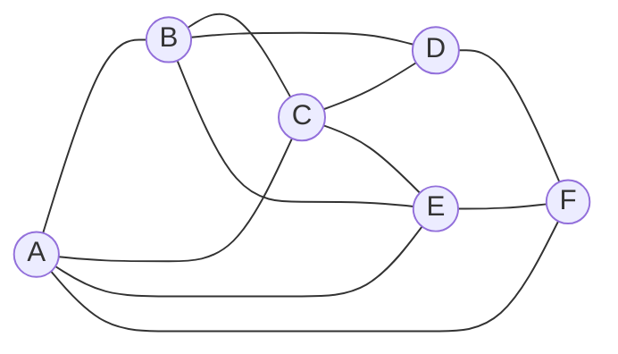

> 1.  Provide the maximal 2-cliques for this graph.

Cliques refer to connected vertices where no additional vertices can be added to
create a larger clique. With maximal 2-cliques, we consider two vertices that
will not form a triangle with any other vertex.

Clique ($k=2$) | Shared neighbors | Can expand
--- | --- | :---:
A, B | C, E | &check;
A, C | B, E | &check;
A, E | B, C, F | &check;
A, F | E | &check;
B, C | A, D, E | &check;
B, D | C | &check;
B, E | A, C | &check;
C, D | B | &check;
C, E | A, B | &check;
D, F | | &cross;
E, F | A | &check;

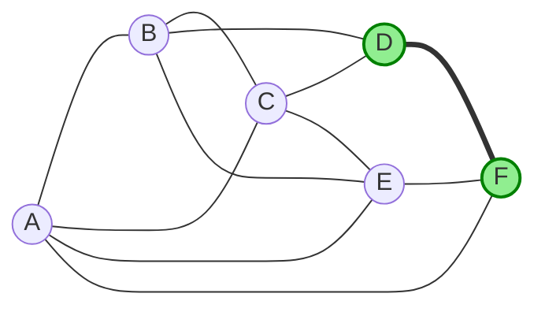

However, if maximal 2-cliques mean at least 2 vertices ($k \geq 2$), we need to
consider larger sets of vertices:

Clique ($k = 3$) | Shared neighbors | Can expand
--- | --- | :---:
A, B, C | E | &check;
A, B, E | C, F | &check;
A, C, E | B, F | &check;
B, C, D | | &cross;
B, C, E | A | &check;
A, E, F | | &cross;

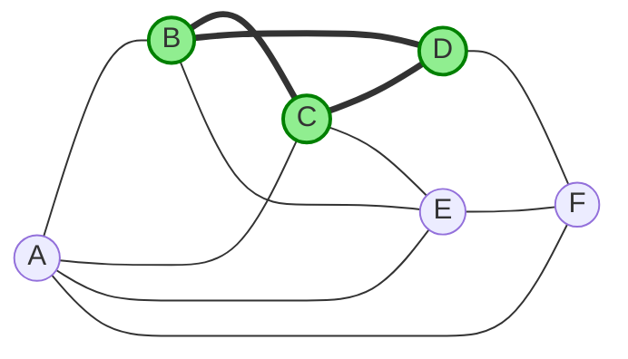
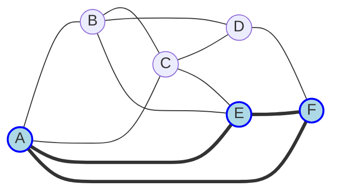

Clique ($k = 4$) | Shared neighbors | Can expand
--- | --- | :---:
A, B, C, E | | &cross;

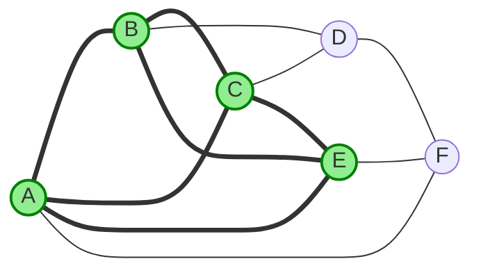

> 2.  Provide the maximal 2-plexes for this graph.

A set of vertices $S$ is a 2-plex if every vertex $v \in S$ has a degree of at
least $|S| - 2$ neighbors. For 6 vertices, the minimum required degree is 4.
Note that a plex cannot contain a subsequent plex of a smaller size. In the
table below, the set of vertices with size 5 is excluded because it contains
sets of size 4 that are also 2-plexes.

Plex ($k=2$) | Missing edges | Required degree | Minimum degree | Has clique
--- | --- | ---: | ---: | :---:
A, B, C, D | A &rarr; D | 2 | 2 | &cross;
A, B, C, E | | 2 | 3 | &cross;
A, B, E, F | B &rarr; F | 2 | 2 | &cross;
A, B, C, D, E | B &rarr; F | 3 | 3 | &check;
A, B, C, E, F | D &rarr; B | 3 | 3 | &check;
B, C, D, E, F | | 3 | 3 | &check;

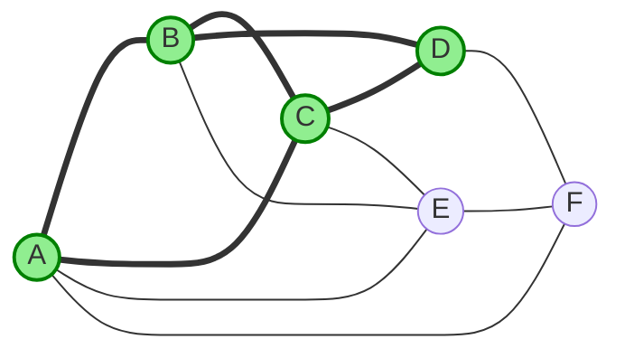
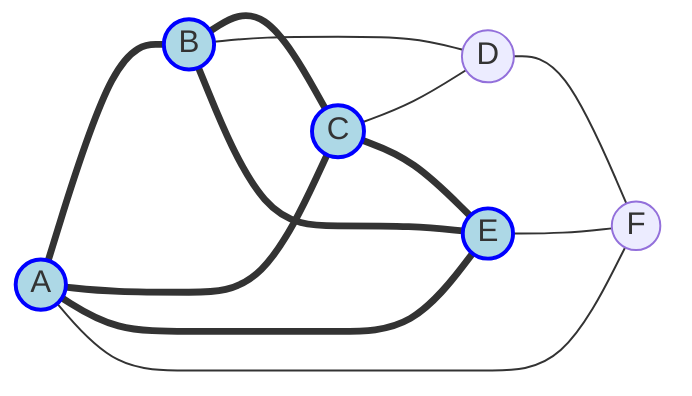
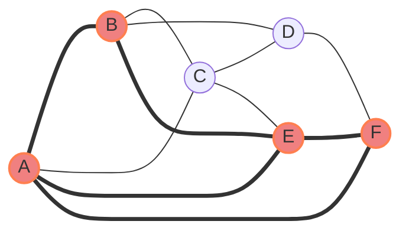

> 3.  Are there any structually equivalent nodes in this graph? If yes, list
      them.

Structurally equivalent vertices have identical edges to all other vertices in
the graph.

Path | Degrees | A | B | C | D | E | F | Equivalent
--- | ---: | --- | --- | --- | --- | --- | --- | :---:
A &rarr; B | 4/4 | A: &hookleftarrow;<br>B: &check; | A: &check;<br>B: &hookleftarrow; | A: &check;<br>B: &check; | A: &cross;<br>B: &check; | A: &check;<br>B: &check; | A: &check;<br>B: &cross; | &cross;
A &rarr; C | 4/4 | A: &hookleftarrow;<br>C: &check; | A: &check;<br>C: &check; | A: &check;<br>C: &hookleftarrow; | A: &cross;<br>C: &check; | A: &check;<br>C: &check; | A: &check;<br>C: &cross; | &cross;
A &rarr; E | 4/4 | A: &hookleftarrow;<br>E: &check; | A: &check;<br>E: &check; | A: &check;<br>E: &check; | A: &cross;<br>E: &cross; | A: &check;<br>E: &hookleftarrow; | A: &check;<br>E: &check; | &cross;
B &rarr; C | 4/4 | B: &check;<br>C: &check; | B: &hookleftarrow;<br>C: &check; | B: &check;<br>C: &hookleftarrow; | B: &check;<br>C: &check; | B: &check;<br>C: &check; | B: &cross;<br>C: &cross; | &check;
B &rarr; E | 4/4 | B: &check;<br>E: &check; | B: &hookleftarrow;<br>E: &check; | B: &check;<br>E: &check; | B: &check;<br>E: &cross; | B: &check;<br>E: &hookleftarrow; | B: &cross;<br>E: &check; | &cross;
C &rarr; E | 4/4 | C: &check;<br>E: &check; | C: &check;<br>E: &check; | C: &hookleftarrow;<br>E: &check; | C: &check;<br>E: &cross; | C: &check;<br>E: &hookleftarrow; | C: &cross;<br>E: &check; | &cross;
D &rarr; F | 3/3 | D: &cross;<br>F: &check; | D: &check;<br>F: &cross; | D: &check;<br>F: &cross; | D: &hookleftarrow;<br>F: &check; | D: &cross;<br>F: &check; | D: &check;<br>F: &hookleftarrow; | &cross;

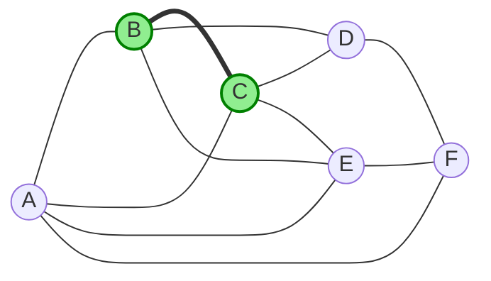

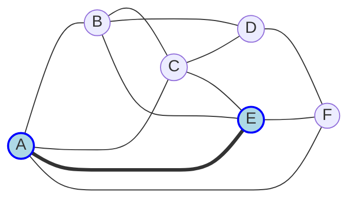

## Problem 2

> Using the graph from problem 1,
>
> 1.  Find a minimum cut that creates partition $P_1$ and $P_2$ where $|P_1|=4$
      and $|P_2|=2$.

Iterate all permutations of partitions $P_1$ and $P_2$ to find the cut sizes.
The minimum cut size is 4, found in $P_1 = \lbrace A, B, C, E \rbrace$ and
$P_2 = \lbrace D, F \rbrace$.

Partition $P_1$ | Partition $P_2$ | Crossing edges | Cut size
--- | --- | --- | ---:
A, B, C, D | E, F | A &rarr; E<br>A &rarr; F<br>B &rarr; E<br>C &rarr; E<br>E &rarr; F | 5
A, B, C, E | D, F | A &rarr; F<br>B &rarr; D<br>C &rarr; D<br>E &rarr; F | 4
A, B, C, F | D, E | A &rarr; E<br>B &rarr; D<br>B &rarr; E<br>C &rarr; D<br>C &rarr; E | 5
A, B, D, E | C, F | A &rarr; C<br>A &rarr; F<br>B &rarr; C<br>C &rarr; D<br>C &rarr; E<br>D &rarr; F<br>E &rarr; F | 7
A, B, D, F | C, E | A &rarr; C<br>A &rarr; E<br>B &rarr; C<br>B &rarr; E<br>C &rarr; D<br>C &rarr; E | 6
A, B, E, F | C, D | A &rarr; C<br>B &rarr; C<br>B &rarr; D<br>C &rarr; D<br>C &rarr; E | 5
A, C, D, E | B, F | A &rarr; B<br>A &rarr; F<br>B &rarr; C<br>B &rarr; D<br>B &rarr; E<br>D &rarr; F<br>E &rarr; F | 7
A, C, D, F | B, E | A &rarr; B<br>A &rarr; E<br>B &rarr; C<br>B &rarr; D<br>B &rarr; E<br>C &rarr; E | 6
A, C, E, F | B, D | A &rarr; B<br>B &rarr; C<br>B &rarr; D<br>B &rarr; E<br>C &rarr; D | 5
A, D, E, F | B, C | A &rarr; B<br>A &rarr; C<br>B &rarr; C<br>B &rarr; D<br>B &rarr; E<br>C &rarr; D<br>C &rarr; E | 7
B, C, D, E | A, F | A &rarr; B<br>A &rarr; C<br>A &rarr; E<br>A &rarr; F<br>D &rarr; F | 5
B, C, D, F | A, E | A &rarr; B<br>A &rarr; C<br>A &rarr; E<br>A &rarr; F<br>B &rarr; E<br>C &rarr; E<br>E &rarr; F | 7
B, C, E, F | A, D | A &rarr; B<br>A &rarr; C<br>A &rarr; E<br>A &rarr; F<br>B &rarr; D<br>C &rarr; D | 6
B, D, E, F | A, C | A &rarr; B<br>A &rarr; C<br>A &rarr; E<br>A &rarr; F<br>B &rarr; C<br>C &rarr; D<br>C &rarr; E | 7
C, D, E, F | A, B | A &rarr; B<br>A &rarr; C<br>A &rarr; E<br>A &rarr; F<br>B &rarr; C<br>B &rarr; D<br>B &rarr; E | 7

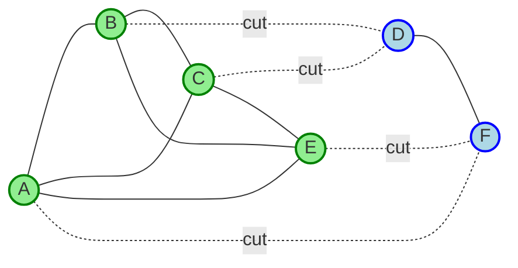

> 2.  Find a minimum cut that creates partition $P_1$ and $P_2$ where
      $|P_1| = |P_2|= 3$.

For both partitions of size 3, the minimum cut size is 5 as seen in
$P_1 = \lbrace A, E, F \rbrace$ and $P_2 = \lbrace B, C, D \rbrace$.

Partition $P_1$ | Partition $P_2$ | Crossing edges | Cut size
--- | --- | --- | ---:
A, E, F | B, C, D | A &rarr; B<br>A &rarr; C<br>E &rarr; B<br>E &rarr; C<br>F &rarr; D | 5
A, B, C | D, E, F | A &rarr; E<br>A &rarr; F<br>B &rarr; D<br>B &rarr; E<br>C &rarr; D<br>C &rarr; E | 6
A, B, E | C, D, F | A &rarr; C<br>A &rarr; F<br>B &rarr; C<br>B &rarr; D<br>E &rarr; C<br>E &rarr; F | 6
A, C, E | B, D, F | A &rarr; B<br>A &rarr; F<br>C &rarr; B<br>C &rarr; D<br>E &rarr; B<br>E &rarr; F | 6
A, D, F | B, C, E | A &rarr; B<br>A &rarr; C<br>A &rarr; E<br>D &rarr; B<br>D &rarr; C<br>F &rarr; E | 6
A, B, D | C, E, F | A &rarr; C<br>A &rarr; E<br>A &rarr; F<br>B &rarr; C<br>B &rarr; E<br>D &rarr; C<br>D &rarr; F | 7
A, B, F | C, D, E | A &rarr; C<br>A &rarr; E<br>B &rarr; C<br>B &rarr; D<br>B &rarr; E<br>F &rarr; D<br>F &rarr; E | 7
A, C, D | B, E, F | A &rarr; B<br>A &rarr; E<br>A &rarr; F<br>C &rarr; B<br>C &rarr; E<br>D &rarr; B<br>D &rarr; F | 7
A, C, F | B, D, E | A &rarr; B<br>A &rarr; E<br>C &rarr; B<br>C &rarr; D<br>C &rarr; E<br>F &rarr; D<br>F &rarr; E | 7
A, D, E | B, C, F | A &rarr; B<br>A &rarr; C<br>A &rarr; F<br>D &rarr; B<br>D &rarr; C<br>D &rarr; F<br>E &rarr; B<br>E &rarr; C<br>E &rarr; F | 9

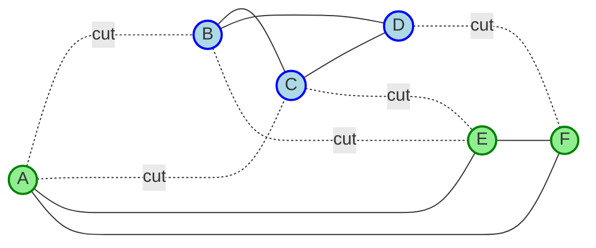

> 3.  For each of the cuts in (1) and (2) above, calculate
>     1.  Ratio cut (P)
>     1.  Normalized cut (P)

The first problem is partitioned by 4-2.

$$
\begin{align}
  P_1 &= \lbrace A, B, C, E \rbrace \\\\
  P_2 &= \lbrace D, F \rbrace \\\\
  \texttt{RATIO-CUT}(P_1, P_2) &=
    \frac{1}{2} \cdot
    \left(
      \frac{\texttt{CUT}(P_1, P_2)}{|P_1|} +
      \frac{\texttt{CUT}(P_1, P_2)}{|P_2|}
    \right) \\\\
  &= \frac{1}{2} \cdot \left(\frac{4}{4} + \frac{4}{2}\right) \\\\
  &= \frac{1}{2} \cdot (1 + 2) \\\\
  &= \frac{1}{2} \cdot 3 &= \mathbf{\frac{3}{2}} \\\\
  \texttt{NORMALIZED-CUT}(P_1, P_2) &=
    \frac{1}{2} \cdot
    \left(
      \frac{\texttt{CUT}(P_1, P_2)}{\sum_{v \in P_1} \deg(v)} +
      \frac{\texttt{CUT}(P_1, P_2)}{\sum_{v \in P_2} \deg(v)}
    \right) \\\\
  &= \frac{1}{2} \cdot \left(\frac{4}{16} + \frac{4}{6}\right) \\\\
  &= \frac{1}{2} \cdot \left(\frac{44}{48}\right) \\\\
  &= \frac{1}{2} \cdot \left(\frac{11}{12}\right) &= \mathbf{\frac{11}{24}}
\end{align}
$$

Both partitions in the second problem are of size 3 (3-3).

$$
\begin{align}
  P_1 &= \lbrace A, E, F \rbrace \\\\
  P_2 &= \lbrace B, C, D \rbrace \\\\
  \texttt{RATIO-CUT}(P_1, P_2) &=
    \frac{1}{2} \cdot \left(\frac{5}{3} + \frac{5}{3}\right) \\\\
  &= \frac{1}{2} \cdot \left(\frac{10}{3}\right) &= \mathbf{\frac{5}{3}} \\\\
  \texttt{NORMALIZED-CUT}(P_1, P_2) &=
    \frac{1}{2} \cdot \left(\frac{5}{11} + \frac{5}{11}\right) \\\\
  &= \frac{1}{2} \cdot \left(\frac{10}{11}\right) &= \mathbf{\frac{5}{11}}
\end{align}
$$

> 4.  Which cut is preferable based on the above metrics?

Looking at the cut size, the 4-2 partition is preferable because it is smaller.
The 4-2 partition is also preferable in the ratio cut. However, the 3-3
partition is slightly better in normalized cut.

Metric | Partitions $\lvert P_1 \rvert = 4, \lvert P_2 \rvert = 2$ | Partitions $\lvert P_1 \rvert = 3, \lvert P_2 \rvert = 3$
--- | ---: | ---:
Cut size | 4 | 5
Ratio cut | 3 | 10/3
Normalized cut | 11/12 | 10/11

## Problem 3

> Social Media Mining (SMM) *Ch. 6, problem 7:*
>
> > **Community Detection**
> >
> > > ```mermaid
> > > graph LR
> > >   1((v<sub>1</sub>))
> > >   2((v<sub>2</sub>))
> > >   3((v<sub>3</sub>))
> > >   4((v<sub>4</sub>))
> > >   5((v<sub>5</sub>))
> > >   6((v<sub>6</sub>))
> > >   7((v<sub>7</sub>))
> > >   8((v<sub>8</sub>))
> > >   9((v<sub>9</sub>))
> > >
> > >   1 --- 2
> > >   1 --- 3
> > >   2 --- 3
> > >   3 --- 4
> > >   3 --- 5
> > >
> > >   subgraph balanced cut C
> > >     4 --- 5
> > >     4 --- 6
> > >     4 --- 7
> > >     5 --- 6
> > >     5 --- 7
> > >
> > >     subgraph balanced cut B
> > >       6 --- 7
> > >       6 --- 8
> > >       7 --- 8
> > >       8 --- 9
> > >
> > >       subgraph minimum cut A
> > >         9
> > >       end
> > >     end
> > >   end
> > > ```
> > >
> > > *Figure 6.8:* Minimum Cut (A) and Two More Balanced Cuts (B and C) in a
> > > Graph.
> >
> > For Figure 6.8:
> >
> > - Compute Jaccard and Cosine similarity between nodes $v_4$ and $v_8$,
> >   assuming that the neighborhood of a node excludes the node itself.

Let $A$, $B$ be the neighborhood of $v_4$ and $v_8$, respectively, excluding the
vertices themselves. Calculate the intersection and union of the two sets. Then,
using the values, compute Jaccard and Cosine similarity.

$$
\begin{align}
  A &= \lbrace v_3, v_5, v_6, v_7 \rbrace \\\\
  B &= \lbrace v_6, v_7, v_9 \rbrace \\\\
  A \cap B &= \lbrace v_6, v_7 \rbrace \\\\
  A \cup B &= \lbrace v_3, v_5, v_6, v_7, v_9 \rbrace \\\\
  \texttt{JACCARD}(A, B) &=
    \frac{|A \cap B|}{|A \cup B|} &=
    \mathbf{\frac{2}{5}} \\\\
  \texttt{COSINE}(A, B) &= \frac{|A \cap B|}{\sqrt{|A| \cdot |B|}} \\\\
  &= \frac{2}{\sqrt{4 \cdot 3}} \\\\
  &= \frac{2}{2 \sqrt{3}} &= \mathbf{\frac{1}{\sqrt{3}}}
\end{align}
$$

> > - Compute Jaccard and Cosine similarity when the node is included in the
> >   neighborhood.

When the vertices themselves are included, both A and B will have an additional
vertex.

$$
\begin{align}
  A &= \lbrace v_3, v_4, v_5, v_6, v_7 \rbrace \\\\
  B &= \lbrace v_6, v_7, v_8, v_9 \rbrace \\\\
  A \cap B &= \lbrace v_6, v_7 \rbrace \\\\
  A \cup B &= \lbrace v_3, v_4, v_5, v_6, v_7, v_8, v_9 \rbrace \\\\
  \texttt{JACCARD}(A, B) &=
    \frac{|A \cap B|}{|A \cup B|} &=
    \mathbf{\frac{2}{7}} \\\\
  \texttt{COSINE}(A, B) &= \frac{|A \cap B|}{\sqrt{|A| \cdot |B|}} \\\\
  &= \frac{2}{\sqrt{5 \cdot 4}} \\\\
  &= \frac{2}{2 \sqrt{5}} &= \mathbf{\frac{1}{\sqrt{5}}}
\end{align}
$$

## Problem 4

> SMM *Ch. 6, problem 9:*
>
> > **Community Evolution**
> >
> > Normalized mutual information (NMI) is used to evaluate community detection
> > results when the actual communities (labels) are known beforehand.
> >
> > - What are the maximum and minimum values for the NMI? Provide details.

According to the textbook, NMI starts from 0 and ends at 1. A value of 0 occurs
when the detected communities are completely independent of the ground truth
communities, that is, there is no mutual information shared between them.
Conversely, 1 indicates that there is a perfect agreement between partitions,
meaning that every vertex belongs to the correct community.

> > - Explain how NMI works (describe the intuition behind it).

Mutual information (MI) is a metric to evaluate how much information regarding
the ground truth communities is obtained from the detected communities. However,
the value can be manipulated, resulting in higher purity values in some
scenarios. Normalized mutual information (NMI) is designed to be a more accurate
measurement because it accounts for the size and number of communities in both
the detected and ground truth partitions.

## Problem 5

> SMM *Ch. 6, problem 10:*
>
> > **Community Evaluation**
> >
> > > ```mermaid
> > > graph LR
> > >   subgraph Community 3
> > >     p7[&plus;]:::community
> > >     p8[&plus;]:::community
> > >     t2[&triangle;]:::community
> > >     t3[&triangle;]:::community
> > >     t4[&triangle;]:::community
> > >     t5[&triangle;]:::community
> > >   end
> > >   subgraph Community 2
> > >     p2[&plus;]:::community
> > >     p3[&plus;]:::community
> > >     p4[&plus;]:::community
> > >     p5[&plus;]:::community
> > >     p6[&plus;]:::community
> > >     m6[&times;]:::community
> > >   end
> > >   subgraph Community 1
> > >     p1[&plus;]:::community
> > >     m1[&times;]:::community
> > >     m2[&times;]:::community
> > >     m3[&times;]:::community
> > >     m4[&times;]:::community
> > >     m5[&times;]:::community
> > >     t1[&triangle;]:::community
> > >   end
> > >
> > > classDef community fill: transparent, stroke: transparent, font-size: 24px
> > > ```
> > >
> > > Figure 6.15: Community Evaluation Example. Circles represent communities,
> > > and items inside the circles represent members. Each item is represented
> > > using a symbol, **&plus;, &times;,** or **&triangle;,** that denotes the
> > > item's true label.
> >
> > Compute NMI for Figure 6.15.

First, count the number of vertices in each community and label. In this
example, the true labels are represented by symbols.

$$
\begin{align}
  |C_1| &= 7 \\\\
  |C_2| &= 6 \\\\
  |C_3| &= 6 \\\\
  |L_1| &= \lbrace +, \ldots \rbrace &= 8 \\\\
  |L_2| &= \lbrace \times, \ldots \rbrace &= 6 \\\\
  |L_3| &= \lbrace \triangle, \ldots \rbrace &= 5 \\\\
  N &= 8 + 6 + 5 &= \mathbf{19}
\end{align}
$$

Community $C$ | Probability $P(C)$ | Label $L$ | Probability $P(L)$
--- | ---: | --- | ---:
$C_1$ | 7/19 | $L_1$ | 8/19
$C_2$ | 6/19 | $L_2$ | 6/19
$C_3$ | 6/19 | $L_3$ | 5/19

Then, calculate mutual information by summing over all non-zero $P_{i, j}$
community-label pairs.

$$
\begin{align}
  \lbrace C_1, + \rbrace &=
    \frac{1}{19} \cdot
    \lg\left(\frac{\frac{1}{19}}{\frac{8}{19} \cdot \frac{7}{19}}\right) \\\\
  &= \frac{1}{19} \cdot \lg\left(\frac{\frac{1}{19}}{\frac{56}{361}}\right)
    &= \mathbf{\frac{1}{19} \cdot \lg\left(\frac{19}{56}\right)} \\\\
  \lbrace C_2, + \rbrace &=
    \frac{5}{19} \cdot
    \lg\left(\frac{\frac{5}{19}}{\frac{8}{19} \cdot \frac{6}{19}}\right) \\\\
  &= \frac{5}{19} \cdot \lg\left(\frac{\frac{5}{19}}{\frac{48}{361}}\right)
    &= \mathbf{\frac{5}{19} \cdot \lg\left(\frac{95}{48}\right)} \\\\
  \lbrace C_3, + \rbrace &=
    \frac{2}{19} \cdot
    \lg\left(\frac{\frac{2}{19}}{\frac{8}{19} \cdot \frac{6}{19}}\right) \\\\
  &= \frac{2}{19} \cdot \lg\left(\frac{\frac{2}{19}}{\frac{48}{361}}\right)
    &= \mathbf{\frac{2}{19} \cdot \lg\left(\frac{19}{24}\right)} \\\\
  \lbrace C_1, \times \rbrace &=
    \frac{5}{19} \cdot
    \lg\left(\frac{\frac{5}{19}}{\frac{6}{19} \cdot \frac{7}{19}}\right) \\\\
  &= \frac{5}{19} \cdot \lg\left(\frac{\frac{5}{19}}{\frac{42}{361}}\right)
    &= \mathbf{\frac{5}{19} \cdot \lg\left(\frac{95}{42}\right)} \\\\
  \lbrace C_2, \times \rbrace &=
    \frac{1}{19} \cdot
    \lg\left(\frac{\frac{1}{19}}{\frac{6}{19} \cdot \frac{6}{19}}\right) \\\\
  &= \frac{1}{19} \cdot \lg\left(\frac{\frac{1}{19}}{\frac{36}{361}}\right)
    &= \mathbf{\frac{1}{19} \cdot \lg\left(\frac{19}{36}\right)} \\\\
  \lbrace C_3, \times \rbrace &&= \mathbf{0} \\\\
  \lbrace C_1, \triangle \rbrace &=
    \frac{1}{19} \cdot
    \lg\left(\frac{\frac{1}{19}}{\frac{5}{19} \cdot \frac{7}{19}}\right) \\\\
  &= \frac{1}{19} \cdot \lg\left(\frac{\frac{1}{19}}{\frac{35}{361}}\right)
    &= \mathbf{\frac{1}{19} \cdot \lg\left(\frac{19}{35}\right)} \\\\
  \lbrace C_2, \triangle \rbrace &&= \mathbf{0} \\\\
  \lbrace C_3, \triangle \rbrace &=
    \frac{4}{19} \cdot
    \lg\left(\frac{\frac{4}{19}}{\frac{5}{19} \cdot \frac{6}{19}}\right) \\\\
  &= \frac{4}{19} \cdot \lg\left(\frac{\frac{4}{19}}{\frac{30}{361}}\right)
    &= \mathbf{\frac{4}{19} \cdot \lg\left(\frac{38}{15}\right)} \\\\
  I(X, Y) &=
    \sum_{i, j} P_{i, j} \cdot
    \lg\left(\frac{P_{i, j}}{P(C_i) \cdot P(L_j)}\right) \\\\
  &=
    \frac{1}{19} \cdot \lg\left(\frac{19}{56}\right) +
    \frac{5}{19} \cdot \lg\left(\frac{95}{48}\right) +
    \frac{2}{19} \cdot \lg\left(\frac{19}{24}\right) + \\\\
  &\quad\quad
    \frac{5}{19} \cdot \lg\left(\frac{95}{42}\right) +
    \frac{1}{19} \cdot \lg\left(\frac{19}{36}\right) +
    \frac{1}{19} \cdot \lg\left(\frac{19}{35}\right) + \\\\
  &\quad\quad
    \frac{4}{19} \cdot \lg\left(\frac{38}{15}\right) \\\\
  &= \frac{1,229}{1,903} &= \mathbf{0.64}
\end{align}
$$

Finally, get the entropy of true labels $H(Y)$ and entropy of detected
communities $H(X)$. These values are used to compute NMI. The NMI is 0.41, which
is closer to 0 (independent).

$$
\begin{align}
  H(X) &= -\sum_i P_i \cdot \lg(P_i) \\\\
  &=
    -\frac{8}{19} \cdot \lg\left(\frac{8}{19}\right) -
    \frac{6}{19} \cdot \lg\left(\frac{6}{19}\right) -
    \frac{5}{19} \cdot \lg\left(\frac{5}{19}\right) \\\\
  &= \frac{2,963}{1,903} &= \mathbf{1.55} \\\\
  H(Y) &= -\sum_j P_j \cdot \lg(P_j) \\\\
  &=
    -\frac{7}{19} \cdot \lg\left(\frac{7}{19}\right) -
    \frac{6}{19} \cdot \lg\left(\frac{6}{19}\right) -
    \frac{6}{19} \cdot \lg\left(\frac{6}{19}\right) \\\\
  &=
    -\frac{7}{19} \cdot \lg\left(\frac{7}{19}\right) -
    2 \cdot \frac{6}{19} \cdot \lg\left(\frac{6}{19}\right) \\\\
  &= \frac{3,012}{1,903} &= \mathbf{1.58} \\\\
  \texttt{NMI}(X, Y) &= \frac{2 \cdot I(X, Y)}{H(X) + H(Y)} \\\\
  &=
    \frac{2 \cdot \frac{1,229}{1,903}}{\frac{2,963}{1,903} +
    \frac{3,012}{1,903}} \\\\
  &= \frac{\frac{2,458}{1,903}}{\frac{5,975}{1,903}} \\\\
  &= \frac{2,458}{5,975} &= \mathbf{0.41}
\end{align}
$$

## Problem 6

> SMM *Ch. 6, problem 11:*
>
> > **Community Evaluation**
> >
> > Why is high precision not enough? Provide an example to show that both
> > precision and recall are important.

In the context of community detection, high precision itself is not considered
sufficient since it only measures the accuracy of the detected communities
without considering the degree of completeness. This is why the recall metric is
also important.

For example, suppose there are 100 true community edges and the algorithm
predicts 5 edge pairs. All 5 predicted edges produce 100% precision. However,
the recall is only 0.05, missing 95% of the true structure compared to the
precision metric.

$$
\begin{align}
  TP &= 5 \\\\
  FP &= 0 \\\\
  FN &= 95 \\\\
  \texttt{PRECISION} &= \frac{TP}{TP + FP} \\\\
  &= \frac{5}{5 + 0} &= \mathbf{1.0} \\\\
  \texttt{RECALL} &= \frac{TP}{TP + FN} \\\\
  &= \frac{5}{5 + 95} &= \mathbf{0.05}
\end{align}
$$

## Problem 7

> SMM *Ch. 6, problem 12:*
>
> > **Community Evaluation**
> >
> > Discuss situations where purity does not make sense.

Purity is a metric that evaluates the true labels within detected communities,
that is, the extent to which a cluster contains a single class. For each
community $C_k$, count nodes from the most frequent true label $L_j$.

$$
\texttt{purity} = \frac{1}{N} \sum_k \max_j |C_k \cap L_j|
$$

However, purity is not suitable when the clusters are fragmented into many tiny
clusters, such as single-node clusters. Because the communities are split into
distinct parts, the purity will not account for completeness (recall), achieving
a perfect 1.0 for each cluster. An unusually high purity score may also occur
when clusters are imbalanced in size, where one giant cluster dominates the
rest.

## Problem 8

> SMM *Ch. 6, problem 13:*
>
> > **Community Evaluation**
> >
> > Compute the following for Figure 6.17:
> >
> > > ```mermaid
> > > graph LR
> > >   subgraph Community 3
> > >     p6[&plus;]:::community
> > >     p7[&plus;]:::community
> > >     p8[&plus;]:::community
> > >     t3[&triangle;]:::community
> > >     t4[&triangle;]:::community
> > >     t5[&triangle;]:::community
> > >   end
> > >   subgraph Community 2
> > >     p2[&plus;]:::community
> > >     p3[&plus;]:::community
> > >     p4[&plus;]:::community
> > >     p5[&plus;]:::community
> > >     m5[&times;]:::community
> > >   end
> > >   subgraph Community 1
> > >     p1[&plus;]:::community
> > >     m1[&times;]:::community
> > >     m2[&times;]:::community
> > >     m3[&times;]:::community
> > >     m4[&times;]:::community
> > >     t1[&triangle;]:::community
> > >     t2[&triangle;]:::community
> > >   end
> > >
> > > classDef community fill: transparent, stroke: transparent, font-size: 24px
> > > ```
> > >
> > > Figure 6.17: Community Evaluation Example.

Given the communities $C$ and true labels $L$, get the total number of vertices
$N$ and the purity score. Find the matching cluster with the highest true
positive count for each label. The purity for this set of communities is 11/18.

$$
\begin{align}
  |C_1| &= 7 \\\\
  |C_2| &= 5 \\\\
  |C_3| &= 6 \\\\
  |L_1| &= \lbrace +, \ldots \rbrace &= 8 \\\\
  |L_2| &= \lbrace \times, \ldots \rbrace &= 5 \\\\
  |L_3| &= \lbrace \triangle, \ldots \rbrace &= 5 \\\\
  N &= 8 + 5 + 5 &= \mathbf{18} \\\\
  \texttt{purity} &= \frac{1}{N} \sum_k \max_j |C_k \cap L_j| \\\\
  &= \frac{\max(C_1) + \max(C_2) + \max(C_3)}{N} \\\\
  &= \frac{\max(1, 4, 2) + \max(4, 1, 0) + \max(3, 0, 3)}{18} \\\\
  &= \frac{4 + 4 + 3}{18} &= \mathbf{\frac{11}{18}}
\end{align}
$$

Label | Matching cluster | True positive $TP$ | False positive $FP$ | False negative $FN$
--- | --- | ---: | ---: | ---:
$L_1: \lbrace +, \ldots \rbrace$ | $C_2$ | 4 | 5 - 4 = 1 | 8 - 4 = 4
$L_2: \lbrace \times, \ldots \rbrace$ | $C_1$ | 4 | 7 - 4 = 3 | 5 - 4 = 1
$L_3: \lbrace \triangle, \ldots \rbrace$ | $C_3$ | 3 | 6 - 3 = 3 | 5 - 3 = 2

Specific to each label, calculate precision, recall and F-measure.

$$
\begin{align}
  \texttt{PRECISION}(L_1) &= \frac{TP}{TP + FP} \\\\
  &= \frac{4}{4 + 1} &= \mathbf{\frac{4}{5}} \\\\
  \texttt{RECALL}(L_1) &= \frac{TP}{TP + FN} \\\\
  &= \frac{4}{4 + 4} \\\\
  &= \frac{4}{8} &= \mathbf{\frac{1}{2}} \\\\
  \texttt{F-MEASURE}(L_1) &=
    \frac{
      2 \cdot
        \texttt{PRECISION}(L_1) \cdot
        \texttt{RECALL}(L_1)
    }{
      \texttt{PRECISION}(L_1) + \texttt{RECALL}(L_1)
    } \\\\
  &=
    \frac{2 \cdot \frac{4}{5} \cdot \frac{1}{2}}{\frac{4}{5} + \frac{1}{2}} \\\\
  &= \frac{\frac{8}{10}}{\frac{8}{10} + \frac{5}{10}} \\\\
  &= \frac{\frac{8}{10}}{\frac{13}{10}} &= \mathbf{\frac{8}{13}} \\\\
  \texttt{PRECISION}(L_2) &= \frac{4}{4 + 3} &= \mathbf{\frac{4}{7}} \\\\
  \texttt{RECALL}(L_2) &= \frac{4}{4 + 1} &= \mathbf{\frac{4}{5}} \\\\
  \texttt{F-MEASURE}(L_2) &=
    \frac{2 \cdot \frac{4}{7} \cdot \frac{4}{5}}{\frac{4}{7} + \frac{4}{5}} \\\\
  &= \frac{\frac{32}{35}}{\frac{20}{35} + \frac{28}{35}} \\\\
  &= \frac{\frac{32}{35}}{\frac{48}{35}} &= \mathbf{\frac{2}{3}} \\\\
  \texttt{PRECISION}(L_3) &= \frac{3}{3 + 3} \\\\
  &= \frac{3}{6} &= \mathbf{\frac{1}{2}} \\\\
  \texttt{RECALL}(L_3) &= \frac{3}{3 + 2} &= \mathbf{\frac{3}{5}} \\\\
  \texttt{F-MEASURE}(L_3) &=
    \frac{2 \cdot \frac{1}{2} \cdot \frac{3}{5}}{\frac{1}{2} + \frac{3}{5}} \\\\
  &= \frac{\frac{6}{10}}{\frac{5}{10} + \frac{6}{10}} \\\\
  &= \frac{\frac{6}{10}}{\frac{11}{10}} &= \mathbf{\frac{6}{11}}
\end{align}
$$

Label | Precision | Recall | F-measure
--- | ---: | ---: | ---:
$L_1: \lbrace +, \ldots \rbrace$ | 4/5 | 1/2 | 8/13
$L_2: \lbrace \times, \ldots \rbrace$ | 4/7 | 4/5 | 2/3
$L_3: \lbrace \triangle, \ldots \rbrace$ | 1/2 | 3/5 | 6/11

## Problem 9

> SMM *Ch. 7, problem 2:*
>
> > **Herd Effect**
> >
> > What are the minimum requirements for a herd behavior experiment? Design an
    experiment of your own.

Herd behavior experiments are designed to study when and why individuals in a
group act collectively, conforming to the majority. Such an experiment requires
two components: individual connections and the capability to observe others'
actions. The study will analyze whether such behavior is transferable to other
contexts.

My proposed experiment involves participants posting product reviews on
e-commerce platforms. It is a variation of the classic urn problem by Anderson
and Holt, where two urns represent verified and likely fake reviews. To be
verified as a good review, some criteria, such as when the reviewer joined the
platform and how many reviews they have written, must be met. It is important to
note that negative reviews can still be considered genuine if they meet the
verification criteria. Participants will post reviews sequentially to update the
private signals reflecting the quality of the reviews.

When the probability is set to a good enough threshold, like 0.7, the reviews
are more likely to be genuine. However, if the initial reviews are fake,
subsequent reviewers may also post fake reviews, leading to an information
cascade. Identifying the cascade point is crucial to determining the success of
this experiment.

## Problem 10

> SMM *Ch. 7, problem 3:*
>
> > **Diffusion of Innovation**
> >
> > Simulate internal-, external-, and mixed-influence models in a program. How
> > are the saturation levels different for each model?

Internal, external and mixed in diffusion models refer to how the saturation
levels differ based on the source of influence. With external influence, where
only mass campaigns are considered, the growth is exponential until it reaches a
saturation point. In contrast, internal influence's adoption happens through
peer-to-peer interactions, resulting in logistic growth. Meanwhile, mixed
influence combines both factors, leading to a bass diffusion model.

$$
\begin{align}
  \texttt{EXTERNAL-N}(t) &= p \cdot (M - N(t)) \\\\
  \texttt{INTERNAL-N}(t) &= q \cdot \frac{N(t)}{M} \cdot (M - N(t)) \\\\
  \texttt{MIXED-N}(t) &=
    p(M - N(t)) +
    q \cdot \frac{N(t)}{M} \cdot (M - N(t))
\end{align}
$$

Suppose the total market size $M = 1,000$ and time steps $T = 50$. Let the
external influence $p = 0.03$, representing a very low decimal value. The
internal influence $q = 0.38$ indicates moderate peer influence. The external
model is expected to show exponential decay towards saturation, never quite
reaching the 100% mark. The internal model starts slowly, but accelerates before
leveling off as it approaches saturation, visually resembling an S-curve. The
mixed model is the fastest method to reach the highest saturation level. At time
step $t = 50$, $N(t)$ values are approximately $80\%$, $90\%$ and $100\%$ for
external, internal and mixed models, respectively.

## Problem 11

> SMM *Ch. 7, problem 4:*
>
> > **Diffusion of Innovation**
> >
> > Provide a simple example of diffusion of innovations and suggest a specific
    way of intervention to expedite the diffusion.

Diffusion of innovations is a process of understanding how new products,
practices or technologies are adopted over time. One example is the adoption of
[radio-frequency identification](https://en.wikipedia.org/wiki/Radio-frequency_identification)
(RFID) technology found in credit cards, transit passes and identification
badges. When it was first patented in 1973, the equipment and infrastructure to
support RFID were too expensive for commercial use. However, the adoption rate
quickly surged when the cost plummeted. In 2011, a tag could be produced for
less than 10 cents.

The diffusion model for RFID technology follows a mixed model where both
internal and external influences play a role. Early adopters were limited to
large enterprises and government agencies that could afford the high cost, which
is the external influence. As the technology matured and prices dropped,
internal influence such as businesses adopting the technology because their
competitors did so too.

Expediting the RFID diffusion process can be achieved through funding
initiatives to subsidize the initial costs for smaller businesses. Internally,
create a set of agreed standards, such as frequency bands, to promote
compatibility and security.

## Problem 12

> SMM *Ch. 7, problem 7:*
>
> > **Information Cascades**
> >
> > Follow the ICM procedure until it converges for the following graph. Assume
> > that node $i$ activates node $j$ when $i − j ≡ 1 \pmod{3}$ and node $5$ is
> > activated at time 0.
> >
> > ```mermaid
> > graph LR
> >   1((1))
> >   2((2))
> >   3((3))
> >   4((4))
> >   5((5))
> >   6((6))
> >
> >   1 <--> 5
> >   1 <--> 6
> >   3 <--> 2
> >   3 --> 4
> >   3 --> 6
> >   4 --> 2
> >   5 --> 2
> >   5 --> 4
> >   6 --> 4
> >   6 --> 5
> > ```

The independent cascade model (ICM) is a form of diffusion model where
information spreads in a network through cascading effects. Initially, only node
5 is active.

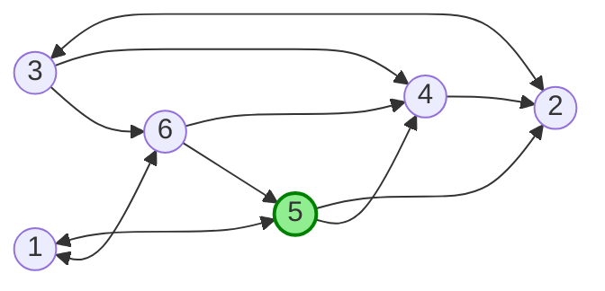

### Iteration 1

Node 5 can go to either 1, 2 or 4. However, the activation rule restricts it to
only 1 and 4.

$$
\begin{align}
  1 &= (5 - 1) \bmod{3} \\\\
  &= 4 \bmod{3} &= \mathbf{1} \\\\
  2 &= (5 - 2) \bmod{3} \\\\
  &= 3 \bmod{3} &= \mathbf{0} \\\\
  4 &= (5 - 4) \bmod{3} \\\\
  &= 1 \bmod{3} &= \mathbf{1}
\end{align}
$$

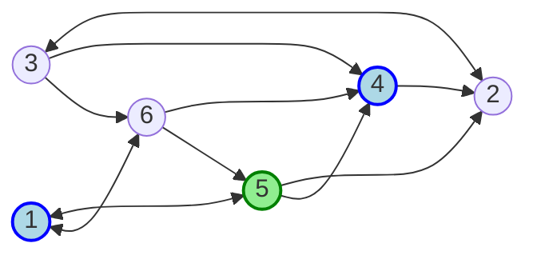

### Iteration 2

With nodes 1 and 4 active, they can now activate their neighbors 3 and 6.

$$
\begin{align}
  2 &= (1 - 2) \bmod{3} \\\\
  &= -1 \bmod{3} &= \mathbf{2} \\\\
  3 &= (1 - 3) \bmod{3} \\\\
  &= -2 \bmod{3} &= \mathbf{1} \\\\
  6 &= (1 - 6) \bmod{3} \\\\
  &= -5 \bmod{3} &= \mathbf{1}
\end{align}
$$

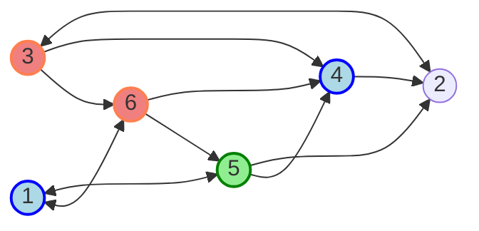

### Iteration 3

Finally, node 3 can activate node 2. There are no other nodes to activate,
ending the iterations.

$$
\begin{align}
  2 &= (3 - 2) \bmod{3} \\\\
  &= 1 \bmod{3} &= \mathbf{1}
\end{align}
$$

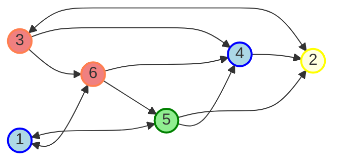
